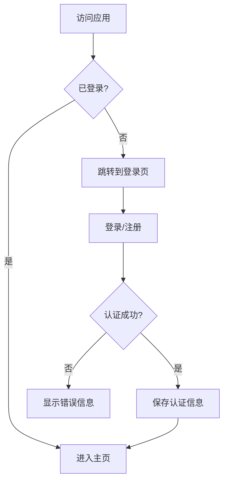
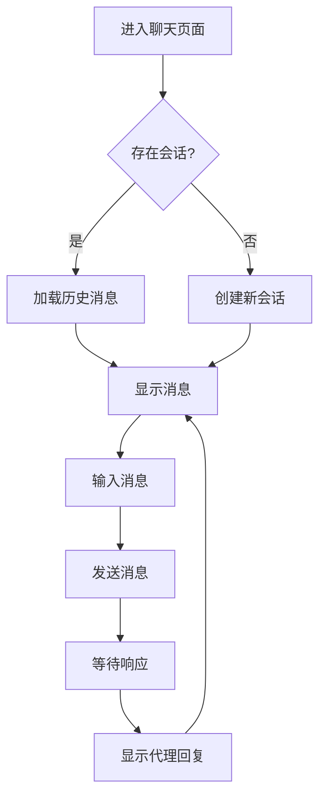
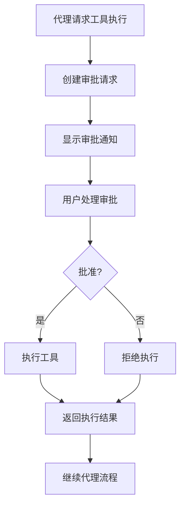

# OpsAgent 前端设计方案

## 1. 概述

OpsAgent 是一个基于 Vue 3 的智能代理管理平台，提供用户友好的界面来管理智能代理、工具和审批流程。本设计方案详细描述了前端架构、组件结构、状态管理和用户交互流程。

## 2. 技术栈

- **核心框架**：Vue 3 (Composition API)
- **状态管理**：Pinia
- **路由管理**：Vue Router 4
- **UI 组件库**：Naive UI
- **构建工具**：Webpack/Vite
- **HTTP 客户端**：Axios

## 3. 项目结构

```
frontend/
├── public/                    # 静态资源
│   └── index.html            # 主页面模板
├── src/                      # 源代码
│   ├── assets/               # 静态资源（图片、样式等）
│   ├── components/           # 可复用组件
│   ├── views/                # 页面级组件
│   ├── router/               # 路由配置
│   ├── stores/               # 状态管理
│   ├── utils/                # 工具函数
│   ├── App.vue               # 根组件
│   └── main.js               # 应用入口
├── package.json              # 项目依赖和脚本
└── README.md                 # 项目说明文档
```

## 4. 架构设计

### 4.1 分层架构

前端采用分层架构设计，确保代码的可维护性和可扩展性：

1. **视图层 (View Layer)**：
   - 页面级组件 (views/)
   - 可复用组件 (components/)

2. **控制层 (Control Layer)**：
   - 路由管理 (router/)
   - 状态管理 (stores/)

3. **服务层 (Service Layer)**：
   - API 调用封装
   - 工具函数 (utils/)

### 4.2 状态管理

使用 Pinia 作为状态管理方案，设计以下核心 store：

#### 4.2.1 用户状态管理 (userStore)
```javascript
// stores/user.js
{
  state: {
    userProfile: Object | null,    // 用户信息
    authToken: String | null,      // 认证令牌
    isLoggedIn: Boolean            // 登录状态
  },
  
  actions: {
    login(),                     // 用户登录
    logout(),                    // 用户登出
    register(),                  // 用户注册
    initializeFromStorage()      // 从本地存储初始化
  }
}
```

#### 4.2.2 会话状态管理 (sessionStore)
```javascript
// stores/session.js
{
  state: {
    sessionId: String | null,     // 当前会话ID
    messages: Array               // 聊天消息历史
  },
  
  actions: {
    createSession(),             // 创建新会话
    addMessage(),                // 添加消息
    clearMessages()              // 清空消息
  }
}
```

#### 4.2.3 工具状态管理 (toolStore)
```javascript
// stores/tool.js
{
  state: {
    tools: Array,                // 工具列表
    approvals: Array             // 审批列表
  },
  
  actions: {
    fetchTools(),               // 获取工具列表
    fetchApprovals(),           // 获取审批列表
    updateToolApproval()        // 更新工具审批状态
  }
}
```

## 5. 路由设计

### 5.1 路由结构

```javascript
[
  {
    path: '/',
    name: 'home',
    component: ChatView,
    meta: { requiresAuth: true }
  },
  {
    path: '/tools',
    name: 'tools',
    component: ToolsView,
    meta: { requiresAuth: true }
  },
  {
    path: '/approvals',
    name: 'approvals',
    component: ApprovalsView,
    meta: { requiresAuth: true }
  },
  {
    path: '/users',
    name: 'users',
    component: UsersView
  }
]
```

### 5.2 路由保护

实现全局前置守卫来保护需要认证的路由：

```javascript
router.beforeEach((to, from, next) => {
  const userStore = useUserStore()
  
  if (to.meta.requiresAuth && !userStore.isAuthenticated) {
    next('/users')
  } else {
    next()
  }
})
```

## 6. 组件设计

### 6.1 根组件 (App.vue)

根组件负责：
- 提供全局 UI 组件（消息提供者、配置提供者等）
- 显示主布局（头部、侧边栏、内容区）
- 管理全局状态初始化

```vue
<template>
  <n-config-provider>
    <n-message-provider>
      <n-layout>
        <n-layout-header>
          <!-- 头部内容 -->
        </n-layout-header>
        
        <n-layout has-sider>
          <n-layout-sider v-if="userStore.isAuthenticated">
            <!-- 侧边栏菜单 -->
          </n-layout-sider>
          
          <n-layout-content>
            <router-view />
          </n-layout-content>
        </n-layout>
      </n-layout>
    </n-message-provider>
  </n-config-provider>
</template>
```

### 6.2 用户管理组件 (UsersView.vue)

负责用户注册、登录和用户信息展示：

```vue
<template>
  <n-tabs>
    <n-tab-pane name="login">
      <!-- 登录表单 -->
    </n-tab-pane>
    
    <n-tab-pane name="register">
      <!-- 注册表单 -->
    </n-tab-pane>
    
    <n-tab-pane name="profile" v-if="userStore.isAuthenticated">
      <!-- 用户信息展示 -->
    </n-tab-pane>
  </n-tabs>
</template>
```

### 6.3 聊天组件 (ChatView.vue)

负责与智能代理的交互：

```vue
<template>
  <n-layout>
    <n-layout-content>
      <!-- 消息展示区域 -->
      <div class="message-container">
        <div v-for="message in sessionStore.messages" :key="message.id">
          <chat-message :message="message" />
        </div>
      </div>
    </n-layout-content>
    
    <n-layout-footer>
      <!-- 消息输入区域 -->
      <n-input-group>
        <n-input v-model:value="inputMessage" />
        <n-button @click="sendMessage">发送</n-button>
      </n-input-group>
    </n-layout-footer>
  </n-layout>
</template>
```

### 6.4 工具管理组件 (ToolsView.vue)

展示和管理可用工具：

```vue
<template>
  <n-layout>
    <n-layout-header>
      <n-button @click="fetchTools">刷新</n-button>
    </n-layout-header>
    
    <n-layout-content>
      <n-data-table :columns="toolColumns" :data="toolStore.tools" />
    </n-layout-content>
  </n-layout>
</template>
```

### 6.5 审批管理组件 (ApprovalsView.vue)

处理工具执行审批：

```vue
<template>
  <n-layout>
    <n-layout-content>
      <n-list>
        <n-list-item v-for="approval in toolStore.approvals" :key="approval.id">
          <approval-item :approval="approval" @approve="handleApprove" @reject="handleReject" />
        </n-list-item>
      </n-list>
    </n-layout-content>
  </n-layout>
</template>
```

## 7. 用户交互流程

### 7.1 用户认证流程



### 7.2 会话交互流程



### 7.3 工具审批流程



## 8. API 接口设计

### 8.1 用户相关接口

| 接口 | 方法 | 路径 | 描述 |
|------|------|------|------|
| 用户注册 | POST | /api/users | 创建新用户 |
| 用户登录 | POST | /api/users/login | 用户认证 |
| 获取用户信息 | GET | /api/users/{user_id} | 获取用户详情 |

### 8.2 会话相关接口

| 接口 | 方法 | 路径 | 描述 |
|------|------|------|------|
| 创建会话 | POST | /api/sessions | 创建新会话 |
| 获取会话 | GET | /api/sessions/{session_id} | 获取会话详情 |
| 发送消息 | POST | /api/sessions/{session_id}/chat | 发送聊天消息 |

### 8.3 工具相关接口

| 接口 | 方法 | 路径 | 描述 |
|------|------|------|------|
| 获取工具列表 | GET | /api/tools | 获取所有工具 |
| 获取工具详情 | GET | /api/tools/{tool_id} | 获取工具详情 |
| 更新工具配置 | PUT | /api/tools/{tool_id} | 更新工具配置 |

### 8.4 审批相关接口

| 接口 | 方法 | 路径 | 描述 |
|------|------|------|------|
| 获取审批列表 | GET | /api/approvals | 获取待审批列表 |
| 审批操作 | POST | /api/approvals/{approval_id}/process | 处理审批请求 |

## 9. 样式和主题

### 9.1 主题配置

使用 Naive UI 的主题系统：

```javascript
// 主题配置
const themeOverrides = {
  common: {
    primaryColor: '#2080F0',
    primaryColorHover: '#4098FC',
    primaryColorPressed: '#1060C9'
  }
}
```

### 9.2 响应式设计

- 支持桌面端和移动端显示
- 侧边栏在小屏幕设备上可折叠
- 表单和表格适配不同屏幕尺寸

## 10. 错误处理和日志

### 10.1 错误处理策略

1. **网络错误**：显示友好的错误提示，提供重试选项
2. **认证错误**：自动跳转到登录页面
3. **业务错误**：根据错误码显示具体错误信息
4. **系统错误**：记录日志并显示通用错误提示

### 10.2 日志记录

```javascript
// 错误日志记录
const logger = {
  error(message, error) {
    console.error(message, error)
    // 可选：发送到远程日志服务
  },
  
  info(message) {
    console.info(message)
  }
}
```

## 11. 性能优化

### 11.1 代码分割

使用路由级别的代码分割：

```javascript
{
  path: '/tools',
  component: () => import('../views/ToolsView.vue')
}
```

### 11.2 数据缓存

- 使用状态管理缓存常用数据
- 实现数据过期机制
- 提供手动刷新功能

### 11.3 懒加载

- 图片懒加载
- 组件懒加载
- 数据懒加载

## 12. 安全性考虑

### 12.1 认证安全

- 使用 HTTPS 传输敏感数据
- 实现 JWT Token 过期机制
- 防止 XSS 和 CSRF 攻击

### 12.2 数据安全

- 敏感信息不存储在本地存储中
- 实现数据加密传输
- 验证用户输入数据

## 15. 未来扩展

### 15.1 功能扩展

- 多语言支持
- 深色主题
- 通知系统
- 富文本消息支持

### 15.2 技术升级

- 迁移到 TypeScript
- 使用 Vue 3.5+ 新特性
- 引入微前端架构