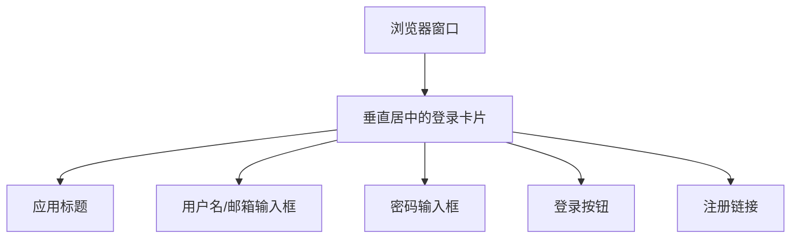
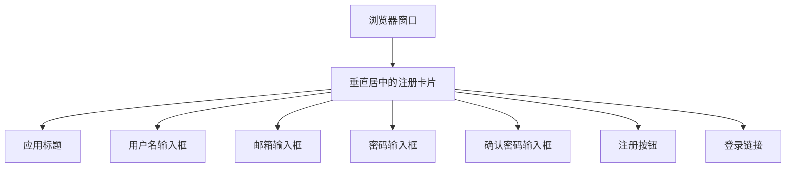
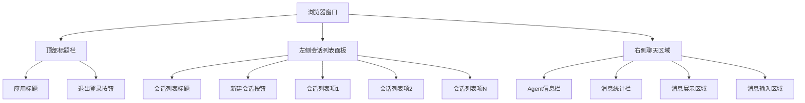
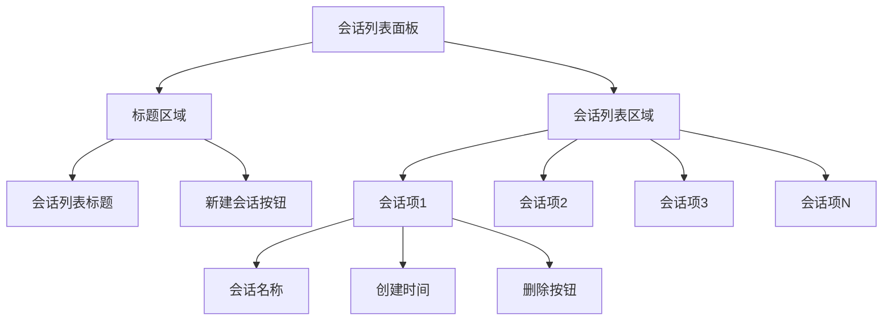
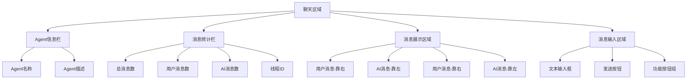

# 前端重构方案

## 1. 项目现状分析

### 1.1 当前功能模块
- 用户认证（登录/注册）
- 会话管理（创建、删除、列表）
- 聊天界面（消息展示、输入）
- 工具管理（已计划移除）
- 审批管理（已计划移除）
- 用户管理（已计划移除）

### 1.2 当前技术栈
- Vue 3 (Composition API)
- Vue Router
- Pinia (状态管理)
- Naive UI (组件库)
- Axios (HTTP客户端)

### 1.3 当前目录结构
```
frontend/
├── public/
├── src/
│   ├── api/              # API调用封装
│   ├── components/       # 可复用组件
│   ├── router/           # 路由配置
│   ├── stores/           # 状态管理
│   ├── utils/            # 工具函数
│   ├── views/            # 页面组件
│   ├── App.vue           # 根组件
│   └── main.js           # 入口文件
├── package.json
└── vue.config.js
```

## 2. 重构目标

### 2.1 界面布局优化
- 左侧：会话列表
- 右侧：聊天界面
- 顶部：标题栏和用户操作

### 2.2 功能模块调整
- 移除工具管理页面
- 移除审批管理页面
- 移除用户管理页面
- 保留核心聊天功能

### 2.3 代码质量提升
- 优化组件结构
- 完善状态管理
- 改进错误处理
- 增强用户体验

## 3. 详细重构计划

### 3.1 会话管理优化
- 在左侧边栏展示用户的所有会话列表
- 支持创建新会话
- 支持删除会话
- 支持选择会话进行聊天

### 3.2 聊天界面改进
- 保持现有的聊天功能
- 优化消息展示样式
- 改进输入区域交互
- 增强响应式设计

### 3.3 路由结构调整
- 简化路由配置
- 移除不必要的路由
- 保持核心聊天路由

### 3.4 状态管理优化
- 完善会话状态管理
- 优化消息状态管理
- 简化用户状态管理

## 4. 实施步骤

### 4.1 第一阶段：基础结构搭建
1. 修改主应用布局，实现左侧会话列表、右侧聊天界面
2. 实现会话列表的基本展示功能
3. 实现会话的创建和删除功能

### 4.2 第二阶段：功能完善
1. 实现会话选择和切换
2. 完善聊天界面与会话的联动
3. 优化界面样式和交互

### 4.3 第三阶段：代码优化
1. 移除无用的页面组件
2. 清理路由配置
3. 优化状态管理代码
4. 完善错误处理机制

## 5. 用户使用逻辑

根据项目规范，前端应用的用户使用逻辑如下：

### 5.1 核心操作流程
1. 用户认证流程（登录/注册）
2. 会话管理流程（创建、查看、切换、删除会话）
3. 聊天交互流程（发送消息、接收回复、管理记录）
4. 系统操作流程（退出登录）

### 5.2 界面布局与交互
- 主界面采用左侧会话列表+右侧聊天区的布局
- 顶部显示标题栏和用户操作按钮
- 用户可通过左侧会话列表快速切换不同会话

### 5.3 主操作路径
1. 用户登录系统
2. 查看左侧会话列表
3. 选择现有会话或创建新会话
4. 在右侧聊天区进行对话交互
5. 可随时切换或管理会话（创建/删除）

## 6. 界面设计

### 6.1 登录界面
- 居中布局的登录卡片
- 用户名/邮箱输入框
- 密码输入框（带显示/隐藏切换）
- 登录按钮
- 注册跳转链接

### 6.2 注册界面
- 居中布局的注册卡片
- 用户名输入框
- 邮箱输入框
- 密码输入框（带显示/隐藏切换）
- 确认密码输入框
- 注册按钮
- 登录跳转链接

### 6.3 主界面（聊天界面）
#### 6.3.1 整体布局
- 顶部标题栏：显示应用名称和退出登录按钮
- 左侧会话列表面板：
  - 会话列表标题和新建会话按钮
  - 可滚动的会话列表项
  - 每个会话项包含会话名称和创建时间
  - 删除会话按钮
- 右侧聊天区域：
  - Agent信息栏（显示Agent名称和描述）
  - 消息统计栏（显示消息数量和线程ID）
  - 消息展示区域（显示用户和AI的对话记录）
  - 消息输入区域（文本输入框和发送按钮）

#### 6.3.2 会话列表面板
- 固定宽度240px的侧边栏
- 顶部包含"会话列表"标题和"+"新建按钮
- 可滚动的会话列表区域
- 每个会话项显示会话名称和创建时间
- 每个会话项右侧有删除按钮
- 当前选中会话有特殊背景色标识

#### 6.3.3 聊天区域
- 顶部Agent信息栏显示Agent名称和描述
- 消息统计栏显示总消息数、用户消息数、AI消息数和线程ID
- 中间消息展示区域：
  - 支持滚动查看历史消息
  - 用户消息靠右显示，AI消息靠左显示
  - 每条消息显示发送时间
- 底部消息输入区域：
  - 多行文本输入框
  - 发送按钮
  - 快速提示按钮
  - 导出聊天记录和清空聊天记录功能按钮

## 7. 界面布局图示

### 7.1 登录界面布局


### 7.2 注册界面布局


### 7.3 主界面布局


### 7.4 会话列表面板详细布局


### 7.5 聊天区域详细布局
